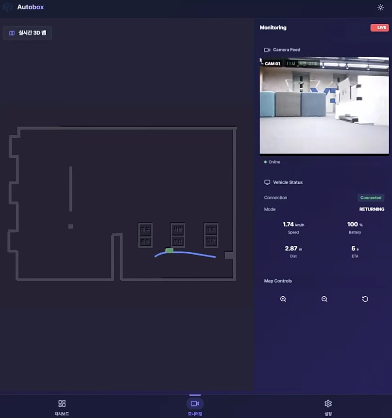
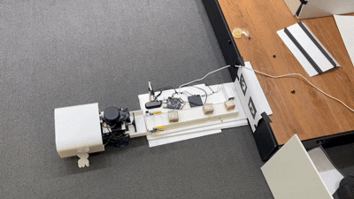
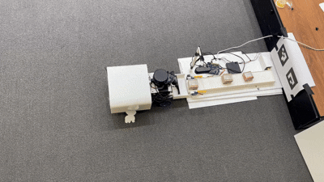
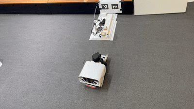

# 📦 AUTOBOX — 스마트 물류 자동 분류 시스템

> | 6인 팀 | 2026.01 ~ 2026.02

OCR로 운송장을 인식하고, 자율주행 RC카가 목적지 구역으로 박스를 자동 분류하는 물류 자동화 시스템입니다.  
Jetson Orin Nano + YPLIDAR X4로 구성된 자율주행 차량이 SLAM 지도 기반으로 주행하며, ArUco 마커를 통해 정밀 후진 주차를 수행합니다.

---

## 🛠 기술 스택 (Tech Stack)

### Embedded & Hardware

   

### Infrastructure & DevOps

   

### Communication

    

---

## 🏗 시스템 아키텍처  및 역할 (System Architecture)

본 시스템은 **3계층, 폐쇄망 구조** 로 설계되었습니다.


<details>
<summary> 📚 각 계층별 역할 및 기능 </summary>

### 1. Cloud

> 전체 시스템의 중앙 관제 및 데이터 분석을 담당합니다.

- **Web Server**: 관리자가 접속하는 대시보드 인터페이스 제공. 하위 노드 데이터, 상태 시각화.
- **AI Server**: 운송장 OCR 수행.
- **Communication**: MQTT 브로커 서버역할 수행. 제어명렁 전송, 텔레메트리 데이터 수신.

### 2. Raspberry Pi

> 컨베이어 벨트 제어와 게이트웨이를 담당하는 **에지 컴퓨팅 노드**입니다.

- **Hardware Control**:

  - `Motor/Servo`: I2C 통신을 통한 컨베이어 벨트 구동.
  - `IR Sensor`: 적외선 센서 입력을 통한 실시간 박스 감지.
  - `USB Camera`: 운송장 정보 캡처
- **Communication & Logic**:

  - **pi <-> server**: 시스템 제어 명령 수신 및 텔레메트리 데이터,운송장 데이터 전송.
  - **pi <-> jetson**: 로컬 네트워크에서 브로커역할 수행.  텔레메트리 데이터 수신 및 제어 명령 전송.
  - **WebRTC & MPEG-TS**: 중계 서버역할.Jetson(이동체)으로부터 전달받은 주행 영상을 수신 및 중계.

### 3. Jetson Orin Nano

> 자율 주행 및 하역을 담당하는 **이동형 로봇 노드**입니다.

- **Hardware & Vision**

  - `Camera`: 마커 추적(Marker Tracking)을 통한 정밀 위치 인식.
  - `Motor/Servo`: PWM 제어 신호를 통한 차량 주행/조향 제어.
  - **Autonomous Driving**: ROS2를 활용한 지정된 목적지로의 경로 계획 및 자율 주행 로직 수행.
- **Communication**:

  - **MQTT**: RPi의 통신 모듈과 연동되어 전체 시스템 상태 동기화.
  - **MPEG-TS (Sender)**: 주행 카메라 영상(전/후방)을 RPi로 실시간 전송.

</details>

---

## 프로젝트 시연

<details>
<summary> 시연 이미지 </summary>

> **웹 대시보드(전체 현황)**
> 

> **웹 대시보드(이동경로, 스트리밍 영상,텔레메트리 데이터)**
> 

> **컨베이어 벨트 이동 및 센서 감지**
> 

> **컨베이어 벨트 - RC 카 상차**
> 

> **장애물 회피**
> 

> **RC 카 주차**
> 

</details>

---

## 🚗 자율주행 파이프라인

```
[SLAM 매핑]  →  [지도 저장]  →  [AMCL 위치 추정]
                                       │
              [OCR 목적지 인식]  ──►  [Nav2 Goal 전송]
                                       │
                                [경로 계획 (A*)]
                                       │
                         [TEB Local Planner 주행]
                         (allow_reversing: true)
                                       │
                         [ArUco 마커 정밀 도킹]
                                       │
                              [박스 하차 → 복귀]
```

### 주요 구현 사항 (한승현 담당)

**ROS2 인프라 구축**
- YPLIDAR X4 드라이버 연동 및 `/scan` 토픽 발행, TF 좌표계 구성
- SLAM Toolbox로 실내 지도 생성, AMCL로 운영 중 실시간 위치 추정
- `bringup` 패키지 구성으로 전체 스택 단일 launch 실행
- LiDAR 좌표계 방향 오설정 문제 → TF 방향 검증 프로세스 정립

**Nav2 자율주행 구현**
- RC카 구조에 맞게 TEB Local Planner 적용 (`allow_reversing: true`)
- Static Costmap(지도) + Obstacle Layer(LiDAR 실시간) + Inflation Layer 조합으로 충돌 방지
- Global Planner(A*)로 전체 경로 계산, 장애물 발생 시 Local Costmap 갱신 후 재계획
- RC카 제자리 회전 불가로 인한 oscillation 문제 → 경로 재계획 주기 및 회전 반경 파라미터 튜닝으로 해결
- 라이다 오도메트리 정지 시 누적 오차 문제 → 도착 시점 좌표 저장 후 재출발 시 갱신하는 방식으로 해결

---

## 📁 레포지토리 구조

```
AUTOBOX/
├── embedded/       # ROS2 자율주행 (Jetson Orin Nano)
│   ├── bringup/    # 전체 스택 launch 패키지
│   ├── navigation/ # Nav2 파라미터 및 주행 노드
│   └── slam/       # SLAM Toolbox 설정
├── ai/             # OCR 및 ArUco 마커 처리
├── backend/        # FastAPI 서버
├── frontend/       # Vue 대시보드
├── docs/           # 시스템 구조도, ERD, API 명세
├── rebuild.sh      # 전체 재빌드 스크립트
└── .gitlab-ci.yml  # CI/CD 파이프라인
```

---

## 🔄 시스템 동작 흐름

1. 컨베이어 벨트에 박스 진입 → 카메라로 운송장 OCR 인식
2. 인식된 목적지 정보를 자율주행 차량에 전달
3. 차량이 SLAM 지도 기반으로 목적지 구역까지 자율 주행
4. ArUco 마커로 컨베이어 도킹 위치에 정밀 후진 주차
5. 박스 하차 완료 → 서버에 상태 보고 → 컨베이어로 복귀
6. 웹 대시보드에서 전체 물류 흐름 실시간 모니터링

---

## 👥 팀 구성 및 역할

| 이름 | 담당 |
|---|---|
| 한승현 | ROS2 인프라 구축, Nav2 자율주행 |
| 그 외 5인 | OCR, 컨베이어 제어, 백엔드, 프론트엔드 |

---

## 🏆 성과

- **삼성전자 우수상** 수상 (SSAFY 14기 AIoT 공통 프로젝트)
- 반 내 발표 시연에서 안정적인 자율주행 시연 성공

---
